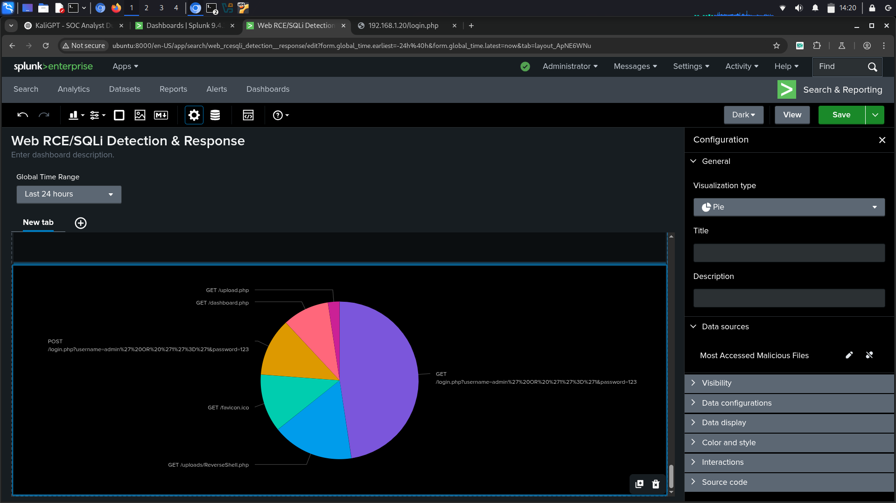
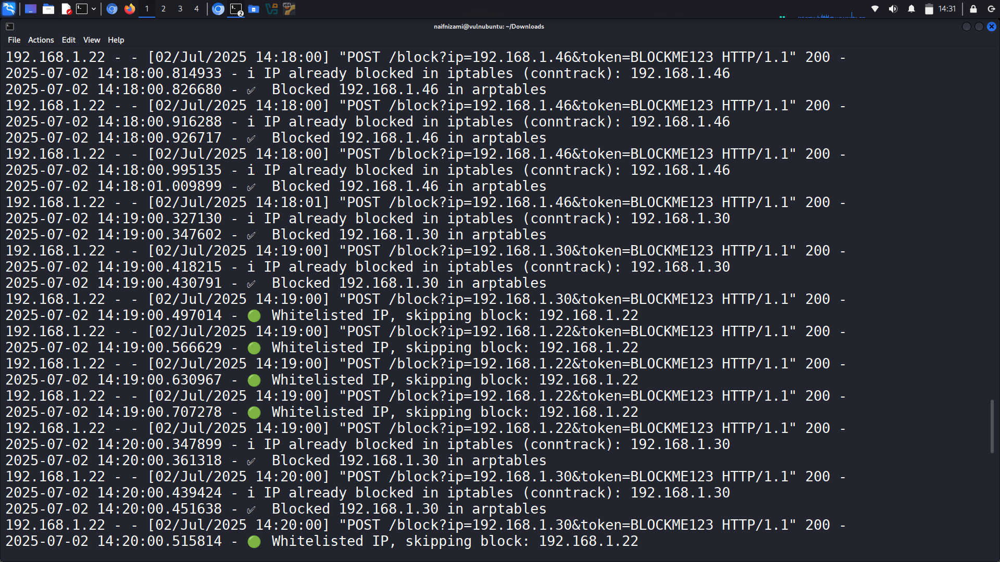
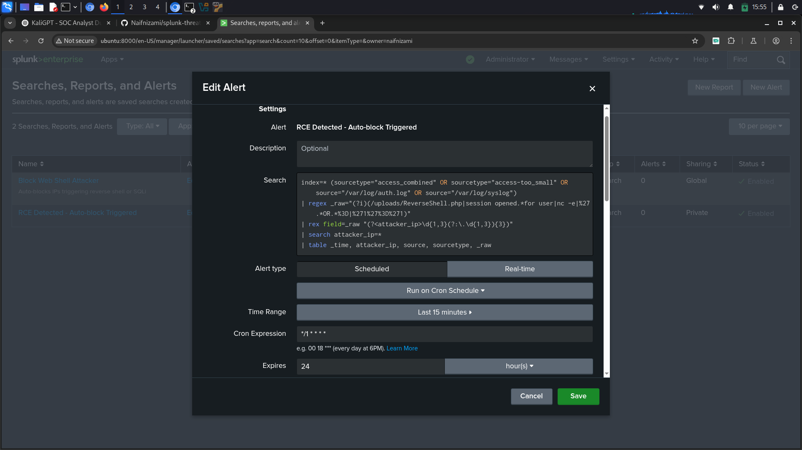

# 🔍 Splunk RCE + SQLi Detection & Response Automation

A practical threat detection and response system using **Splunk** and a custom **Python-based IP blocker** to detect and mitigate SQL Injection (SQLi) and Remote Code Execution (RCE) attacks in real-time.

---

## 🚀 Features

- ✅ Real-time detection of:
  - SQL Injection (SQLi) attempts  
  - Reverse shell payload access  
- 🔒 IP auto-blocking via `iptables` + `arptables` through webhook  
- 📬 Email alerts with attacker IPs and log evidence  
- 📊 Splunk dashboard panels:
  - Top attacker IPs  
  - Malicious file access  
  - Alert frequency over time  
- 🛡️ Whitelisting for trusted or internal IPs  

---

## 🧠 Use Case

Simulates a **real-world SOC detection-response workflow**, integrating:

- Apache access & auth/syslog monitoring  
- Python-based blocking API  
- Splunk alerting & webhook-driven response  

Ideal for cybersecurity training and portfolio projects.

---

## 🛠 Tech Stack

- Splunk Enterprise (9.x) & Universal Forwarder  
- Python 3 + Flask  
- PHP  
- MySQL  
- Linux VMs (Ubuntu, Kali)  
- iptables, arptables, curl, nc  
- Git, GitHub

---

## 📥 Installation

1. Install **Splunk Enterprise** on the main analysis host:  
   [Download Splunk Enterprise](https://www.splunk.com/en_us/download/splunk-enterprise.html?locale=en_us)

2. Set up a **listening port** in Splunk Enterprise for data collection:
   
   To enable Splunk Enterprise to receive data from Universal Forwarders, you need to configure a listening port.

   ### Steps to Configure a Listening Port in Splunk:
   - Open Splunk Enterprise in your browser at `http://<splunk-server>:8000`.
   - Log in with your **Splunk admin credentials**.
   - In the **Splunk Web interface**, go to **Settings** > **Forwarding and Receiving** > **Configure Receiving**.
   - Click on **New Receiving Port**.
   - A pop-up window will appear to input the port.
   - Enter **9997** (or your desired port number) in the input field and press **Enter**.
   - You can enable or disable the port as needed. Ensure that the port is **enabled** to start receiving data from the Universal Forwarder.
   - After entering the port, click **Save** to finalize the configuration.

   This will make Splunk ready to listen on port `9997` (or your chosen port) for data from the **Universal Forwarder**.

3. Install **Splunk Universal Forwarder** on the monitored/victim VM(s):  
   [Download UF (previous releases)](https://www.splunk.com/en_us/download/previous-releases-universal-forwarder.html)

4. On victim VMs:
   ```bash
   # Launch vulnerable PHP app in web folder
   # Import database schema:
   mysql -u root -p < db/vulnsite_schema.sql

   # Deploy UF config to monitor logs:
   splunk add forward-server <your-splunk-ip>:9997  # (Splunk Enterprise IP)
   splunk add monitor /var/log/apache2/access.log
   splunk add monitor /var/log/auth.log
   splunk add monitor /var/log/syslog

   # Deploy blocker API
   sudo python3 blocker.py

📂 Project Structure

| File/Folder        | Description                                            |
| ------------------ | ------------------------------------------------------ |
| `blocker.py`       | Flask API to block attackers via firewall              |
| `splunk/`          | SPL queries, saved alerts, alert setup docs            |
| `screenshots/`     | Screenshots of dashboard, alerts, and blocking         |
| `Screenrecording/` | Short video walkthrough (SQLi ➜ RCE detection → block) |
| `web/`             | Vulnerable app source files (PHP, uploads, etc.)       |
| `db/`              | Database schema (vulnsite\_schema.sql)                 |

## 📸 Visuals & Walkthrough

- **Splunk Dashboard** – detection panels:

   
   *Displays real-time detection of SQLi & RCE attempts, top attacker IPs, and malicious file access.*

- **Blocker Console** – IP block logs:

   
   *Displays logs of IPs blocked in response to detected attacks.*

- **Email Alert sample**:

   
   *Example of an email sent when an attacker is detected.*

- **SPL Query Result showing detected logs:**

   
   *Result from the SPL query used to detect malicious activities.*

- **Vulnerable Web Interface** – app used in testing:

   
   *Simulated vulnerable web application demonstrating SQLi & RCE exploitation.*

---

## 🎥 Walkthrough Video

Here’s a short video walkthrough of the detection & blocking workflow:

You can [download the Splunk Workflow video (Compressed)](Screenrecording/Splunk_Workflow_compressed.mp4) to watch it on your local machine.

## 💡 Setup & Execution Steps

### 1. Launch the vulnerable PHP app from the `web/` folder.
   - Navigate to the `web/` folder and launch the vulnerable PHP application. This app will simulate the attack scenarios for SQLi and RCE.

### 2. Import `db/vulnsite_schema.sql` into MariaDB.
   - Import the database schema to set up the vulnerable site in MariaDB:
     ```bash
     mysql -u root -p < db/vulnsite_schema.sql
     ```

### 3. Deploy both **Splunk Enterprise** & **Universal Forwarder**.
   - **Splunk Enterprise**: Install and configure Splunk Enterprise on the analysis host.
   - **Splunk Universal Forwarder**: Install and configure the Universal Forwarder on the victim VM(s) to forward logs to Splunk Enterprise.

### 4. Run `blocker.py` to listen on port 5000.
   - Start the **blocker.py** script, which listens for malicious activity and blocks the attacker IPs via firewall.
     ```bash
     sudo python3 blocker.py
     ```

### 5. Create a Splunk alert using the following **SPL** query to catch malicious activity:
   - In **Splunk**, create a new alert with the following **SPL** query:
     ```spl
     index=* (sourcetype="access_combined" OR sourcetype="access-too_small" OR source="/var/log/auth.log" OR source="/var/log/syslog")
     | regex _raw="(?i)(/uploads/ReverseShell.php|session opened.*for user|nc -e|%27.*OR.*%3D|%271%27%3D%271)"
     | rex field=_raw "(?<attacker_ip>\d{1,3}(?:\.\d{1,3}){3})"
     | search attacker_ip=*
     | table _time, attacker_ip, source, sourcetype, _raw
     ```

### 6. Configure the **webhook alert action**:
   - Set up a webhook in Splunk to trigger an IP block whenever a malicious attack is detected. Configure the webhook action as follows:
     ```bash
     http://<target-ip>:5000/block?ip=$result.attacker_ip$&token=BLOCKME123
     ```
   - *(Optional)*: Enable throttled email alerts for visibility into attack events.

---

## 🎯 Goal

This project demonstrates **security automation** and **response skills** using **SIEM**, **scripting**, **firewall**, and **alerting** techniques. It’s excellent for showcasing **SOC competencies** and practical cybersecurity knowledge.

---

## ✉️ Contact

Created by **Naif Nizami** · ★ **Welcome to ⭐ this repo** if you find it useful!

