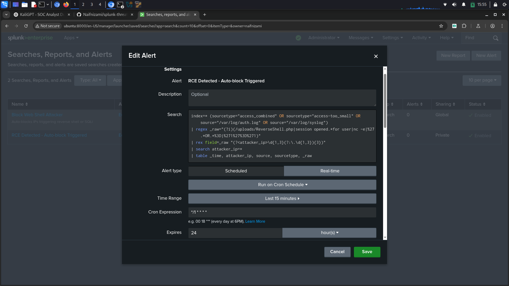
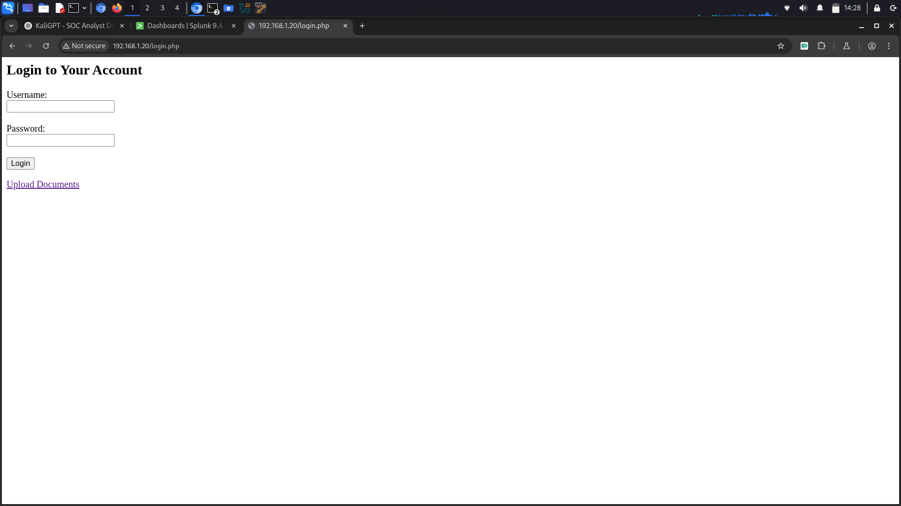

# 🔍 Splunk RCE + SQLi Detection & Response Automation

A practical threat detection and response system using **Splunk** and a custom **Python-based IP blocker** to detect and mitigate SQL Injection (SQLi) and Remote Code Execution (RCE) attacks in real-time.

---

## 🚀 Features

- ✅ Real-time detection of:
  - SQL Injection (SQLi) attempts
  - Reverse shell payload access
- 🔒 IP auto-blocking using `iptables` + `arptables` via webhook
- 📬 Email alerts with attacker IP and evidence
- 📊 Splunk dashboards:
  - Top attacker IPs
  - Malicious file access attempts
  - Alert frequency over time
- 🛡️ Whitelisting support for internal/testing IPs

---

## 🧠 Use Case

This project replicates a **real-world SOC detection-response workflow**, integrating:

- Apache access log monitoring
- Python-based API for blocking attackers
- Splunk alerting & automated webhook triggering

Perfect for security analysts and blue teamers in training.

---

## 📂 Files

| File/Folder        | Description                                        |
|--------------------|----------------------------------------------------|
| `blocker.py`       | Python Flask API to block IPs via firewall rules  |
| `screenshots/`     | Evidence of detection, email, blocking, dashboards|
| `splunk/`          | Saved alerts, SPL queries, and setup docs         |

---

## 📸 Screenshots

### 🖥️ 1. Splunk Dashboard (Live Detection Panels)

### 🚫 2. Auto-Blocking Console Log

### 📬 3. Email Alert Sample

### 💡 4. SPL Matching RCE + SQLi Logs

### 🌐 Vulnerable Web Application Interface
  
*Landing page of the intentionally vulnerable PHP app used to simulate SQLi and reverse shell attacks.*

---

## 🛠️ Tech Stack

- Splunk 9.x
- Python 3 + Flask
- Linux (Ubuntu, Kali)
- iptables, arptables
- curl, netcat

---

## 📝 Setup Summary

1. **Deploy vulnerable app** (PHP-based login/upload).
2. **Configure Splunk forwarder** to monitor:
   - `/var/log/apache2/access.log`
   - `/var/log/auth.log`, `/var/log/syslog`
3. **Deploy `blocker.py`** on the target VM.
4. **Create Splunk alerts** with webhook trigger:
   - `http://<target-ip>:5000/block?ip=$result.attacker_ip$&token=BLOCKME123`
5. **Enable email alert** for same SPL with throttle.

---

## ✉️ Contact

Made with 💻 by [Naif Nizami](https://github.com/Naifnizami)  
⭐ Star this repo if you find it useful for learning or security portfolio building.
