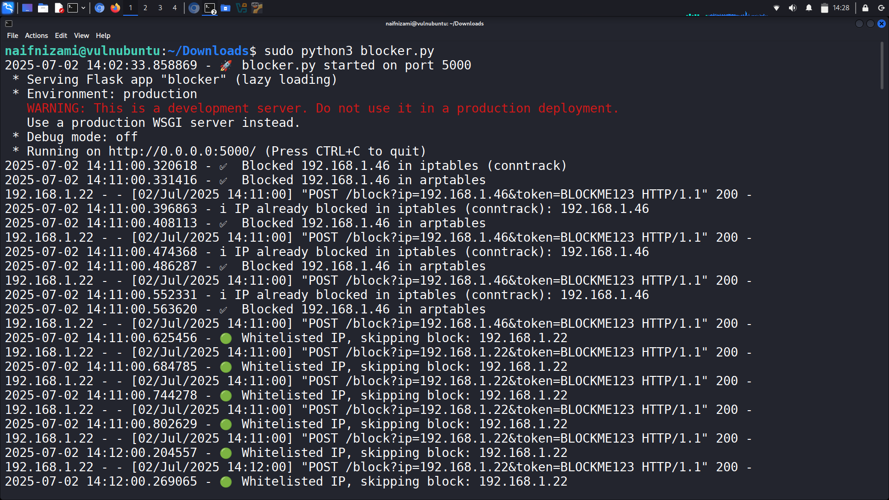
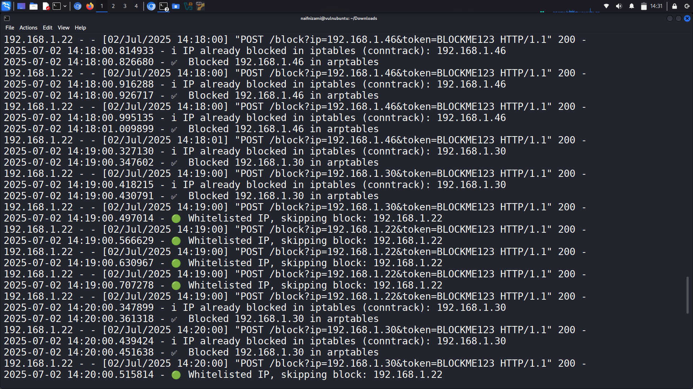
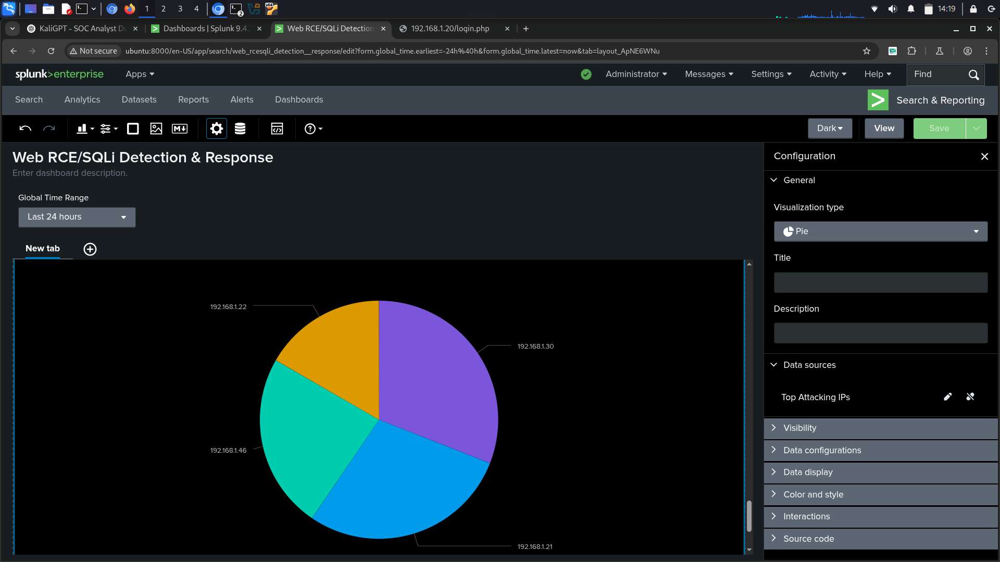
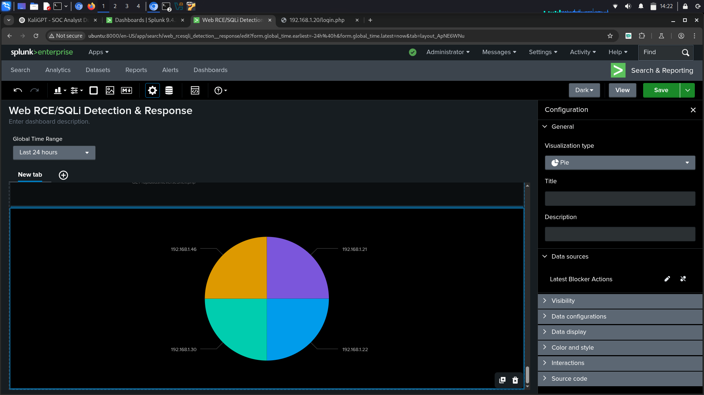
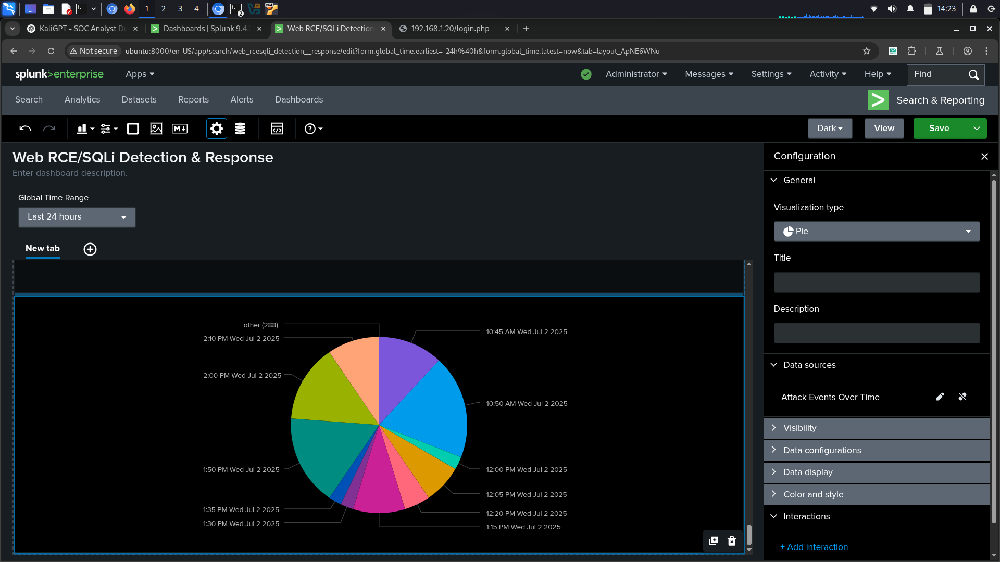
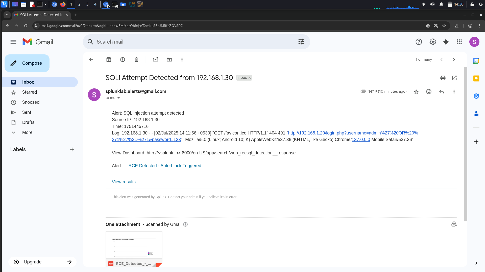
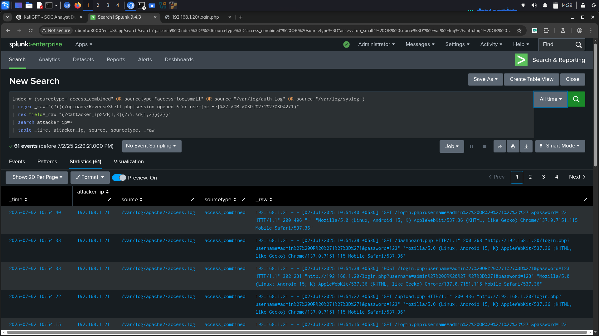
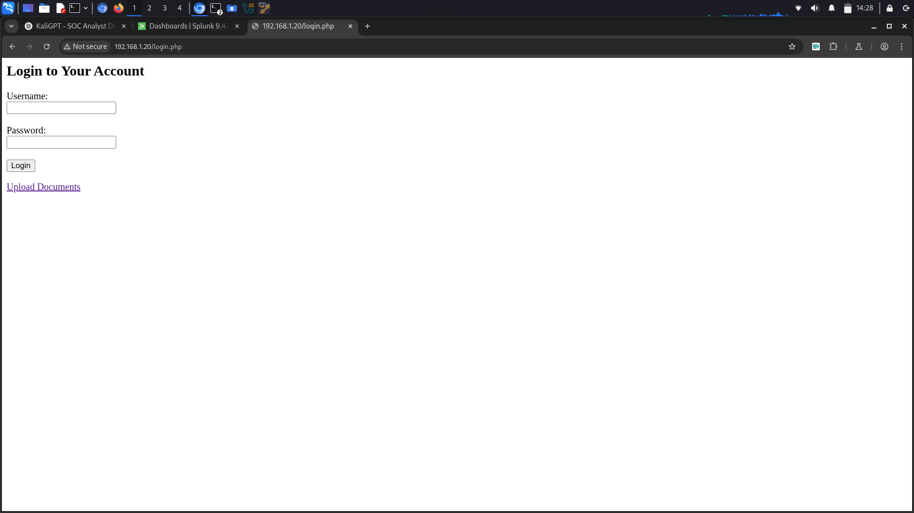

# 🔍 Splunk RCE + SQLi Detection & Response Automation

A practical threat detection and response system using **Splunk** and a custom **Python-based IP blocker** to detect and mitigate SQL Injection (SQLi) and Remote Code Execution (RCE) attacks in real-time.

---

## 🚀 Features

- ✅ Real-time detection of:
  - SQL Injection attempts
  - Reverse shell payloads and backdoors
- 🔒 Automated IP blocking via `iptables` and `arptables` through a Flask-based webhook
- 📬 Email alerts with attacker IPs and matching log data
- 📊 Splunk dashboard including:
  - Top attacker IPs
  - Malicious file access activity
  - Alert frequency over time
- 🛡️ Whitelist protection for trusted internal IPs (e.g. testing environments)

---

## 📁 Files

- `blocker.py` – Flask API server for real-time IP blocking
- `sreenshots/` – Visual references of the project in action

---

## 📸 Screenshots

### 🔧 Blocker Setup

### 💻 Blocker Console Logs

### 📊 Dashboard Panels
| Alert Log Panel | SQLi Panel | RCE Panel | Top IPs |
|-----------------|------------|-----------|---------|
|  |  |  |  |

### 📩 Email Alert Triggered

### 🔍 Matching SPL Query

### 🌐 Detected Attack on Web Interface

---

## 💡 Use Case

This project emulates a real-world **SOC (Security Operations Center)** use case—integrating log monitoring, alerting, and automated incident response. Perfect for:
- Cybersecurity labs
- Red/Blue team scenarios
- Resume-ready portfolio demonstrations

---

## 🛠️ Tech Stack

- Splunk 9.x (Search Head + Universal Forwarder)
- Python 3 (Flask)
- iptables / arptables (for blocking logic)
- Linux (Ubuntu)
- GitHub

---

## 🧠 Learn More

- [Splunk Alerting Documentation](https://docs.splunk.com/Documentation/Splunk/latest/Alert/TriggerConditions)
- [Flask Web Framework](https://flask.palletsprojects.com/)
- [iptables/arptables Guide](https://wiki.archlinux.org/title/Iptables)

---

## 🙋‍♂️ Author

Made with 💻 by [Naif Nizami](https://github.com/Naifnizami)  
⭐ Star this repo if you find it useful!

